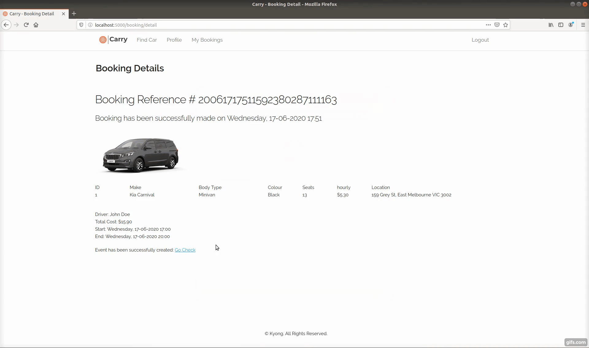
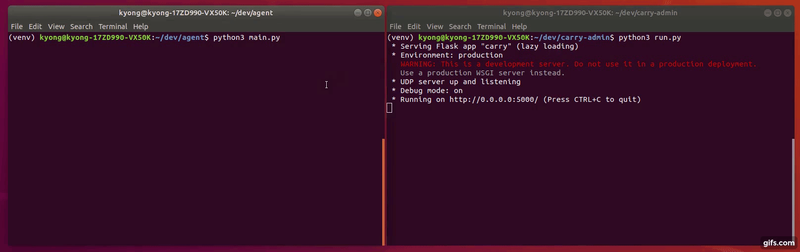
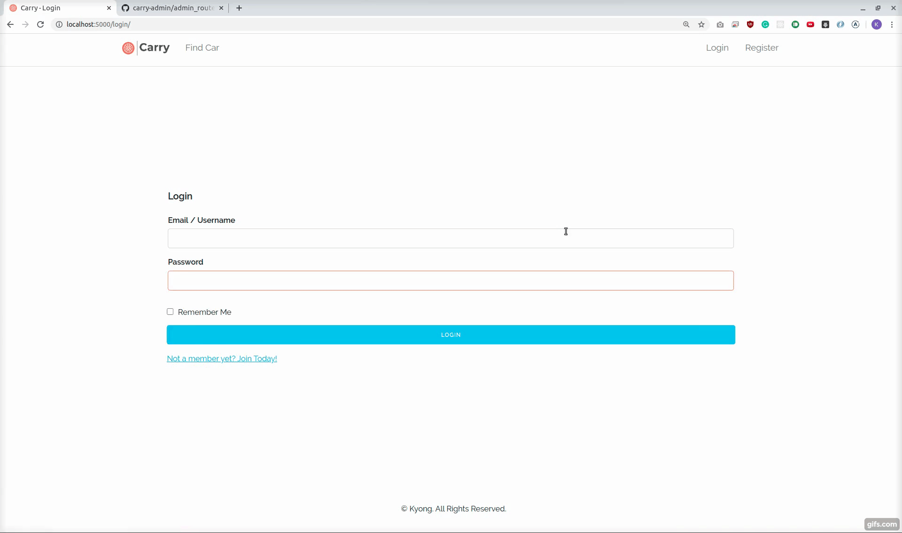
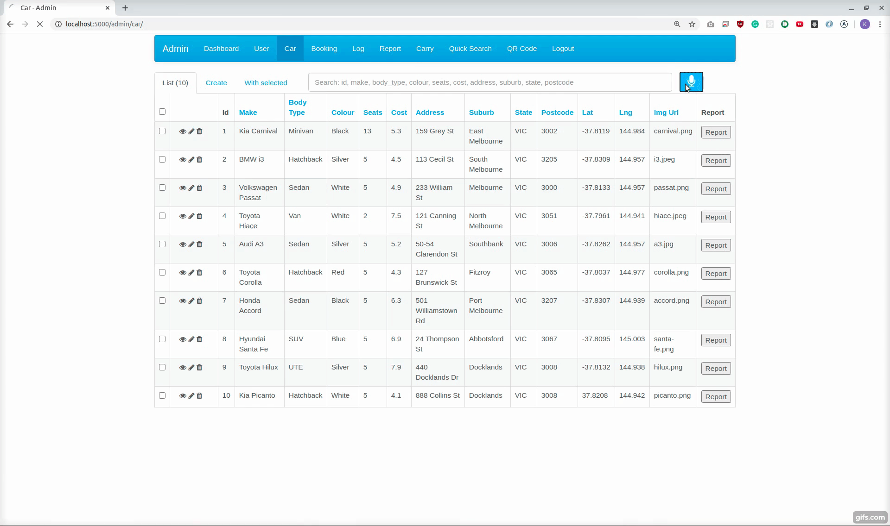
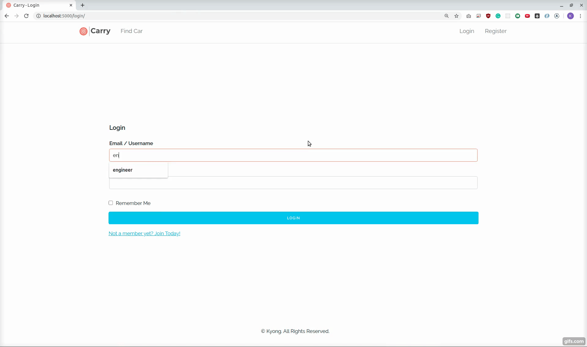

# CARRY

## About Carry
<strong>Carry</strong> is a Car Sharing System where Agents can talk to Master Server via socket connection to allow customers to have access, as well as a Flask web application is deployed on the server in another thread simultaneously. The web application has two different parts, one for customers where they can search cars, book and manage their bookings, and the other part is for employees where managers can see visulisation graphs indicating business status to help them to make a business decision, admins can maintain the data regarding the system, and engineers are able to check out reported cars and find the car's location. <br /><br />
<strong>Agent</strong> is based on a console-based system, which allows customers to log in with either their credentials and facial recognition. It also has features for engineers such as Bluetooth Auto Connection and QR Code Reader, so that the engineers can easily finish their jobs. The applications are built by using

- [Flask](https://flask.palletsprojects.com/)
- [Google Cloud SQL](https://console.cloud.google.com/marketplace/details/google-cloud-platform/cloud-sql?pli=1)
- [SQLAlchemy](https://www.sqlalchemy.org/)
- [Google Calendar API](https://developers.google.com/calendar/)
- [Google Speech-To-Text](https://cloud.google.com/speech-to-text/)
- [UDP Socket Programming](https://realpython.com/python-sockets/)
- [Skeleton CSS](http://getskeleton.com/) [For Customer Website]
- [Unittest](https://docs.python.org/3/library/unittest.html/)
- [Sphinx](https://www.sphinx-doc.org/en/master/)
- [Bootstrap](https://getbootstrap.com/) [For Admin Website]
- [Flask Admin](https://flask-admin.readthedocs.io/en/latest/introduction/) [For Admin Website]
- [Pushbullet](https://www.pushbullet.com/)
- [PyZBar](https://pypi.org/project/pyzbar/)
- [Braintree](https://developers.braintreepayments.com/)
- [Google Data Studio](https://support.google.com/datastudio/answer/6283323?hl=en)
- [Chart.js](https://www.chartjs.org/)

## Development & Deployment Environment
Development Environment: Ubuntu 18.04</br>
Deployment Environment: Raspbian on Raspberry Pi 3 Model B+

## Architectrue


## How to install

#### Clone the project
```
$ git clone https://github.com/s3634359/carry-admin
$ cd carry-admin
```

#### Virtualevn
```
$ source venv/bin/activate
```

#### Install packages in requirements.txt
```
$ pip3 install -r requirements
```

#### Run
```
$ python3 run.py
```

### Sphinx
```
$ python3 sphinx.py
```

or 

#### Make html
```
$ cd docs
$ make clean
$ sphinx-apidoc -o source ..
$ make html
```

#### Open the html in browser
```
$ cd docs
$ firefox build/html/index.html &
```

#### Create a pdf file
```
$ cd docs
$ sphinx-build -b rinoh source _build/rinoh
```

##### Auto-generated pdf document by Sphinx
[carry.pdf](https://github.com/s3634359/carry-admin/tree/master/docs/_build/rinoh/carry.pdf).

### Unittest
Test APIs
```
$ python3 -m unittest test_database_utils.py
```


## Documentation


# Product
### Login and search cars as a customer
- Only available cars display in the list during the specific period.
- Unavailable cars will be marked in black colour.


### Book, confirm and pay with a credit card


### Add to Google Calendar
- Customers can add it to their calendars if they want


### Socket
- The instant location of the agent is being sent through socket for logging. 


### Admin
- All data can be maintained by admins.


### Voice Recognition / Report a car with an issue / Pushbullet Notification


### Engineer
- The QR code for the engineers' profile can be scanned on Agents to complete the repair jobs. The data is being updated via socket.


### Manager
- The system shows diagrams with the integrated data by using Chart.js and Google Data Studio.
